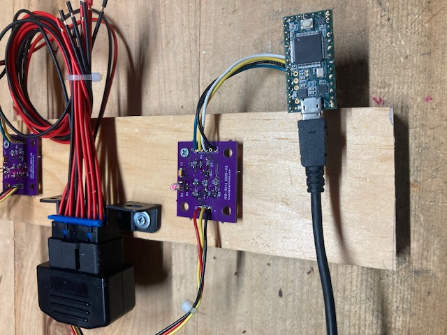
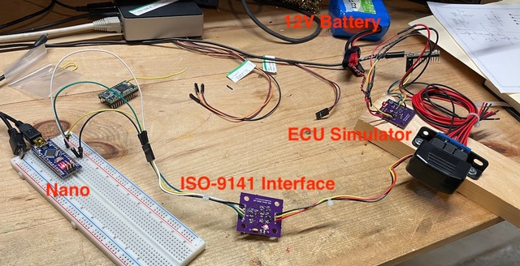
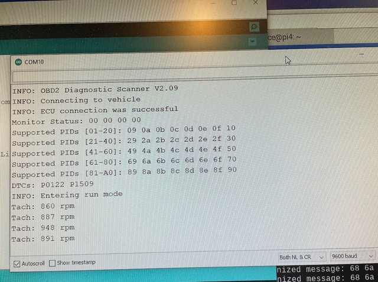
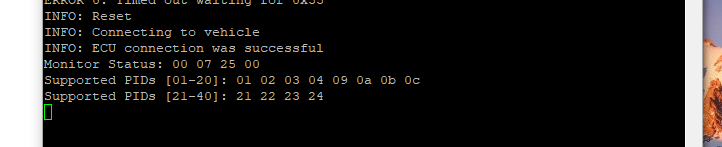

Overview
========

This project is a simple demonstration of how to communicate with a car via the OBD-II (on board diagnostic)
connector.  This connector allows you to read diagnostic codes from the car's engine control unit (ECU) and to get some real-time performance data.

This project supports the ISO-9141-2 K-Line interface.  The more modern CAN bus is not supported yet - that's a different project.

This has been tested on a 2005 Toyota Corolla and a 1999 Honda Civic (D16Y7 engine).

The design has been used to read DTC codes out of the Civic.

The [code is here](https://github.com/brucemack/hello-obd2/blob/main/hello-obd2.ino).  This is a C program developed using the Arduino platform.

To make things easier to test, a [companion ECU simulator was also constructed](https://github.com/brucemack/ecu-sim).  This simulator allows testing without needing to connect to an actual vehicle.

Hardware
========

Custom hardware was built to provide physical connectivity to the car. Here's what the development platform looks like:

The purple PCB was designed and manufactured specifically for this application.  Please see [this related project](https://github.com/brucemack/iso9141-interface) for more information about the hardware implementation.

This interface uses the Teensy 3.2 microcontroller.  The Teensy controller is helpful here because it supports more than one hardware serial port.

The K-Line interface is challenging because it sends and receives on the same wire.  This is a 12V interface pulled up by a 560 ohm resistor and pulled down by a 2N3904 NPN transistor.  An extra transistor stage is used as an inverter.  Special arrangements need to be made in software to ignore the "echo" of the transmitted data on the single wire.

One other challenge is that the ISO-9141 specification defines a slow handshake at the start of the connection: the so-called "5 Baud" interface.  Because the Teensy 3.2 (or most any controller) is not capable of generating such a slow transmission rate, we use "bit banging" to generate that 2 second handshake.  A separate I/O pin is used for this purpose to avoid conflicts with the UART.  Please see the "CTL0" input in the schematic below.

Normal transmission happens at 10,400 baud (8/none) as defined in the ISO spec.

Here's the schematic, as simulated in LT-Spice:

Here's the initial protoctype:

A standard SAE J1962 OBD2 connector is used (male).  Pins used are:
* 5 - Signal ground 
* 7 - ISO9141 K-Line
* 12 - +12V

Software Notes
==============

The ISO document that describes the physical interface is [here](https://andrewrevill.co.uk/ReferenceLibrary/OBDII%20Specifications%20-%20ISO-9141-2%20(Physical).pdf)

Please see [this page](https://en.wikipedia.org/wiki/OBD-II_PIDs) for a list of the PIDs used.

Notes on Integration with an Arduino Nano
=========================================

It would be helpful to demonstrate support for the Arduino Nano, given how ubiquitous this part is. There are two 
challenges that need to be studied:
* The Nano only has a single hardware UART which is connected to the USB connector on the board. We want to leave that 
available for user interaction (console) so it can't be used for communicating with a vehicle. An alternate UART is needed.
* There are Arduino libraries that support "software serial" capability on arbitrary pins.  However, the mainstream library
distributed by Arduino doesn't support simultaneous bidirectional communications. Note that we don't necessarily need 
bidirectional communications since the K-Line is a *one wire protocol*, but the original code was developed using 
hardware UARTs that supports bidirectional and it will be a lot easier if all implementations work this way.

Paul Stoffrogen (of Teensy fame) has created [this library](https://www.pjrc.com/teensy/td_libs_AltSoftSerial.html) that supports 
bi-directional software serial ports. In my experience, Paul knows what he is doing! 

The latest version (2.09) has been tested using this configuration and it worked on the first try.

The Nano used for this test was not an authentic Arduino board. I used an ELEGOO Nano clone which contained a CH340 USB interface
which is a cheap substitute for the FT232. The only tricky thing with these clone Nano boards can be getting the right USB 
driver for the CH340 chip.

Hookup notes:
* Pin D9 on the Nano goes to pin 2 (yellow)  on the ISO-9141 board
* Pin D8 on the Nano goes to pin 1 (green) on the ISO-9141 board
* Pin D2 on the Nano goes to pin 3 (white) on the ISO-9141 board
* Pin GND on the Nano goes to pin 5 (black) on the  ISO-9141 board

Demo Pictures (Nano) 
====================

Here's the complete setup, attached to my [ECU Simulator](https://github.com/brucemack/ecu-sim):

Here's what the console outout looks like. On connection, the demo asks the vehicle 
for the list of supported PIDs, any current diagnostic trouble codes (DTCs), and then polls for the engine RPM every 15 seconds.

The ECU simulation reports two trouble codes: P0122 (throttle position sensor) and P1509 (IACV sensor failure).

Standards
=========

* Electrical: https://cdn.standards.iteh.ai/samples/16737/e6b719fd44c345a792656f6d19e6cee4/ISO-9141-1989.pdf (note: probably an unauthorized copy)
* Protocol: http://forum.amadeus-project.com/index.php?act=attach&type=post&id=9491 (note: probably an unauthorized copy)
* Good detail: https://www.irjet.net/archives/V4/i7/IRJET-V4I7181.pdf

Example
=======

Here's the initial output as seen on a 2005 Toyota Corolla:

Analysis (using this: https://en.wikipedia.org/wiki/OBD-II_PIDs):
* Status:
    * No check-engine light (MIL)
    * No DTCs saved
    * Tests availble for Components, Fuel System, Misfire
    * Tests availble for Oxygen sensor, Evaporative system, at Catalyst
    * No tests are incomplete
* PIDs supported
    * 01 - Status
    * 02 - Freeze DTC
    * 03 - Fuel system status
    * 04 - Engine load
    * 09 - Long term fuel trim (2)
    * 0A - Fuel pressure
    * 0B - Intake manifold pressure
    * 0C - Engine speed
    * 21 - Distance traveled with MIL indicator
    * 22 - Fuel rail pressure
    * 23 - Fuel rail gauge pressure
    * 24 - Oxygen sensor 1

