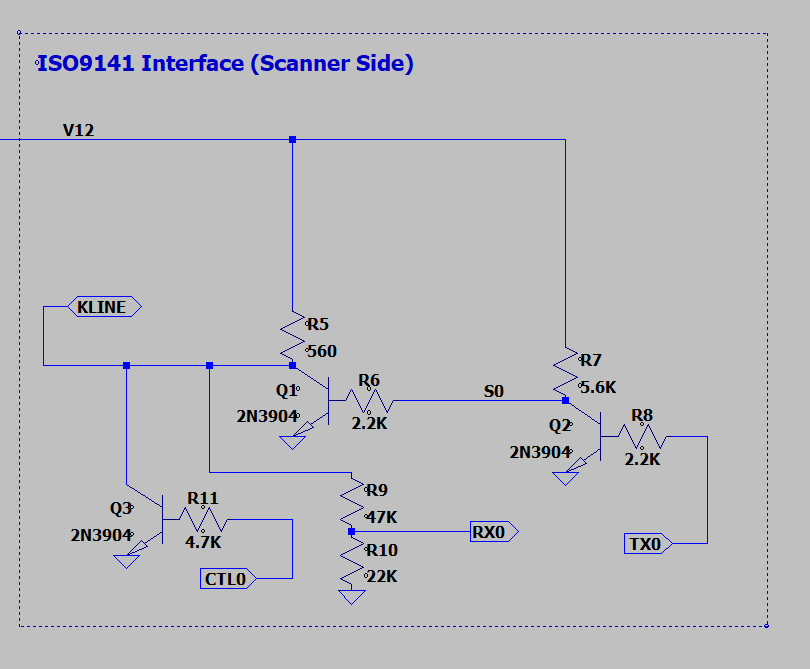
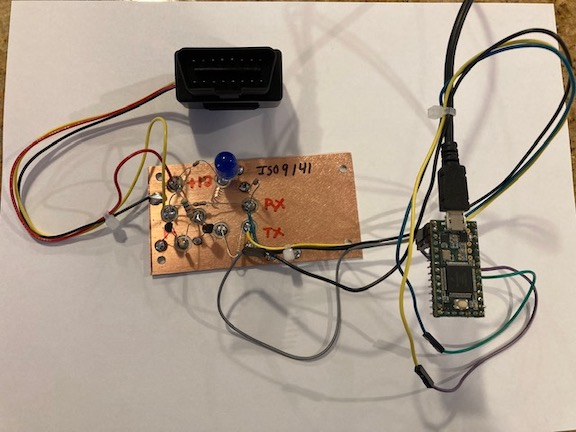
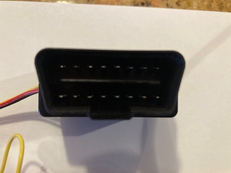

Overview
========

This is a simple demonstration of communicating with a car via the OBD-II (on board diagnostic)
connector.  This supports the ISO-9141-2 K-Line interface. 

Hardware
========

This interface uses the Teensy 3.2.  The Teensy processor is helpful here because it supports more 
than one hardware serial port.

The K-Line sends and receives on the same wire.  This is a 12V interface pulled up by a 560 ohm resistor and pulled down by a 2N3904 NPN transistor.  An extra transistor stage is used as in inverter.

One challenge is that the ISO-9141 uses a very slow handshake at the start of the connection: the so-called "5 Baud" interface.  Because the Teensy 3.2 (or most any controller) is not capable of generating such a slow transmission, we use "bit banging" to generate that 2 second handshake.  A separate IO pin is used for thsi purpose to avoid conflicts with the UART.  Please see the "CTL0" input in the schematic below.

Here's the schematic, as simulated in LT-Spice:

Here's the initial protoctype:

A standard SAE J1962 OBD2 connector is used (male).  Pins used are:
* 5 - Signal ground 
* 7 - ISO9141 K-Line
* 12 - +12V

Software Notes
==============

The ISO document that describes the physical interface is [here](https://andrewrevill.co.uk/ReferenceLibrary/OBDII%20Specifications%20-%20ISO-9141-2%20(Physical).pdf)

Please see [this page](https://en.wikipedia.org/wiki/OBD-II_PIDs) for a list of the PIDs used.

